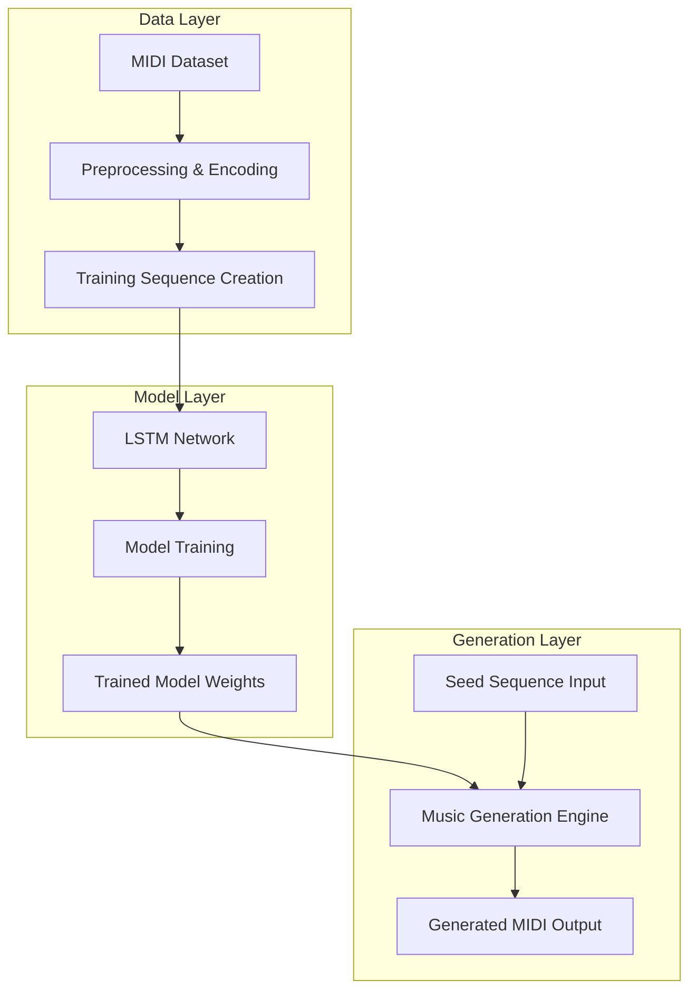

# LSTM-Based Music Generation  
Neural Network-Based Music Composition System  

---

## Overview  

This project is a deep learning–based music generation system that uses Long Short-Term Memory (LSTM) networks to learn patterns from musical sequences and generate new compositions.

It provides a complete pipeline including dataset preprocessing, sequence modeling, neural network training, and MIDI music generation. The system demonstrates how sequential neural networks can capture temporal dependencies in music and produce stylistically coherent compositions.

The project is designed with modularity and extensibility in mind, making it suitable for experimentation, research, and portfolio demonstration.

---

## Core Idea  

Music is inherently sequential, each note depends on previous notes. Traditional neural networks struggle with long-term dependencies, but LSTMs are specifically designed to retain contextual memory across long sequences.

This system includes:

**Data Processing**
- Parse MIDI files
- Extract notes and chords
- Convert musical events into numerical sequences

**Sequence Modeling**
- Create fixed-length input sequences
- Predict the next note in a sequence

**LSTM Network**
- Learn temporal dependencies
- Model probability distribution of next musical event

**Music Generation**
- Use a trained model with a seed sequence
- Generate new notes iteratively
- Export results as MIDI files

The model effectively learns the musical grammar of the dataset.

---

## System Capabilities  

### Training Pipeline  
- Load and preprocess MIDI datasets  
- Encode musical notes into numerical format  
- Train LSTM model with configurable hyperparameters  
- Save trained model weights  

### Music Generation  
- Generate new music from trained model  
- Adjustable generation length  
- Seed-based controlled composition  
- Export output as playable MIDI files  

### Model Architecture  
- Sequential LSTM layers  
- Dropout for regularization  
- Dense output layer with softmax activation  
- Categorical prediction of next note  

---

## High-Level System Architecture  

The system follows a structured pipeline divided into three primary layers: Data Processing, Model Training, and Music Generation.  
Each layer is modular, enabling clear separation of responsibilities and easy extensibility. The data layer prepares musical sequences, the model layer learns temporal patterns using an LSTM network, and the generation layer produces new compositions based on the trained model.

## Design Principles  

- Sequential Learning First – Optimized for temporal pattern recognition  
- Modular Structure – Separate data processing, training, and generation modules  
- Reproducible Experiments – Configurable hyperparameters  
- Extensible – Adaptable for different genres or model improvements  

---

## Workflow Summary  

1. Add MIDI dataset to project directory  
2. Preprocess music into note sequences  
3. Train LSTM model  
4. Save trained weights  
5. Generate new music using a seed sequence  
6. Export generated composition as MIDI file  

---

## Technology Stack  

- Language: Python  
- Deep Learning Framework: TensorFlow / Keras  
- Music Processing: music21  
- Numerical Computing: NumPy  
- File Format: MIDI  

---

## Intended Use Cases  

- AI-based music composition  
- Academic research in sequence modeling  
- Learning LSTM networks  
- Creative experimentation with generative models  
- Deep learning portfolio project  

---

## Future Improvements  

- Transformer-based architecture  
- Attention mechanisms  
- Web-based music preview interface  
- Multi-instrument support  
- Style transfer across genres  

---

## License  

This project is licensed under the MIT License.
